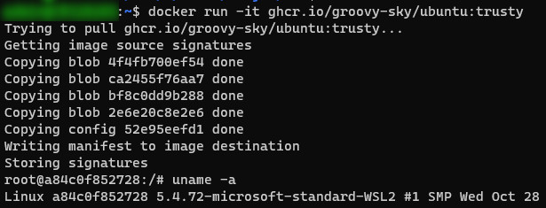

# Using GitHub as the Container registry

This repository gives an example of using GitHub as an alternative to Docker Hub for building and storing Docker images. Images are built from official repositories. 

Workflows used for builds you can find [here](.github/workflows). Results you can see [on this page](https://github.com/groovy-sky?tab=packages&repo_name=docker).

Images are available anonymously:
